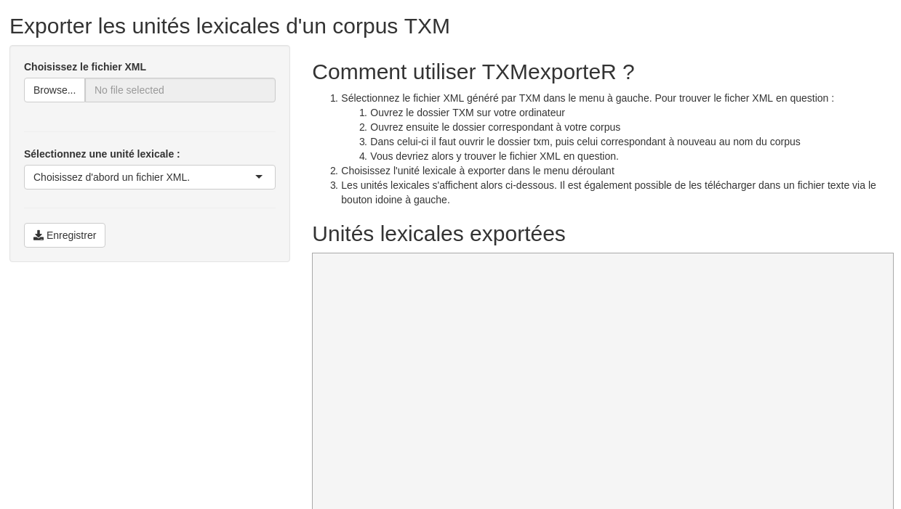

# TXMexportR

Application Shiny permettant d'exporter les unités lexicales (formes graphiques, lemmes, étiquettes morpho-syntaxiques...) présentes dans un corpus TXM après un étiquetage réalisé par le logiciel TreeTagger.

# Installation

Dans une session R ou bien RStudio :

```R
devtools::install_git("https://framagit.org/leodumont/txmexportr/")
```

Attention cela implique d'avoir préalablement installé et chargé le paquet `devtools` et que [git](https://git-scm.com/downloads) soit installé sur votre ordinateur :

```R
install.packages("devtools")
library(devtools)
```

# Utilisation

```R
library(txmexportr)
launchApp()
```

Il n'y alors plus qu'à utiliser l'interface graphique.


